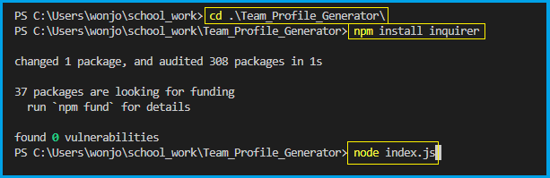

# Team Profile Generator

## Description

This is a Node.js command-line application that takes in information about employees on a software engineering team, then generates an HTML webpage that displays summaries for each person.

- Use JavaScript to implement this application
- Use 'inquirer' to get command-line user inputs 
- Use 'fs' to create an 'index.html' file
- Use a recursive function to take in information about employees
- Use Bootstrap to configure the webpage
- Use Font Awesome to display icons for each role
- Add functions to validate the proper format of the email address, the office number and other user inputs

## Table of Contents
1. [Installation](#installation)
2. [Usage](#usage)
3. [License](#license)
4. [Contributing](#contributing)
5. [Test](#test)
6. [Questions](#questions)

## Installation

1. Move to the directory where index.js is
2. npm install inquirer
3. node index.js

Please refer to the image below.

## Usage

1. When a user runs this application, it first requests a user to enter the manager's information.
2. Once a user has entered the required information about the manager, it presents a menu with the option to add an engineer or an intern or to finish adding a team member.
    - If a user selects the option to add an engineer or an intern, it requests a user to enter the engineer's or intern's information and then presents a menu shown in step.2 again.
    - If a user selects the option to finish adding a team member, it creates an index.html file to display summaries for added team members.

- `Walkthrough Video`: https://watch.screencastify.com/v/AQeIHXJuTc5oXxPxWCoe

## License

Copyright (c) 2022 `wonjong2` (GitHub Username) Licensed under [the MIT License](https://choosealicense.com/licenses/mit/).

## Contributing

All your inputs are valuable and I love them.

- Reporting a bug
- Submiiting a fix
- Proposing new features

## Test

1. npm install jest
2. npm run test

## Questions

1. GitHub: https://github.com/wonjong2
2. If you have any questions, please reach out to wonjong2@gmail.com
